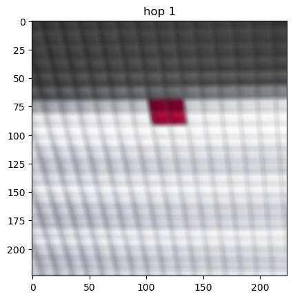
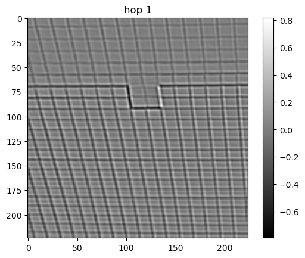
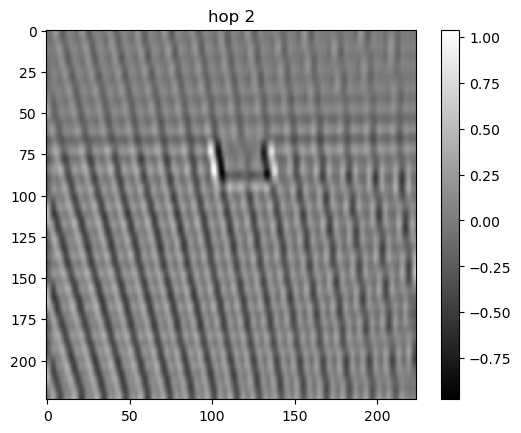
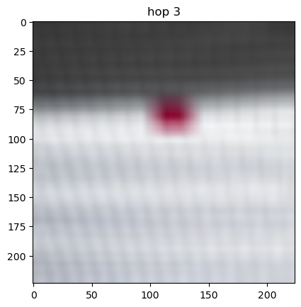
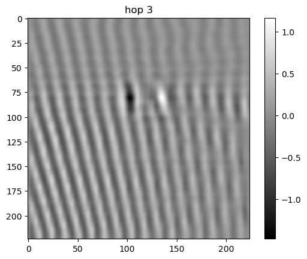
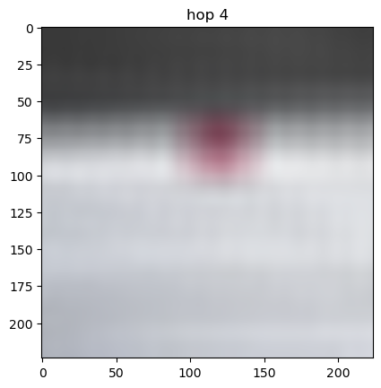
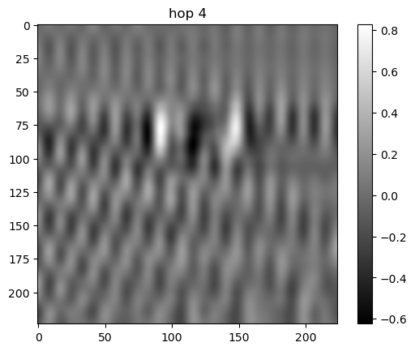

# Color Texture Decomposition

This is a color texture decomposition using Pytorch.
Please refer to this [jupyter notebook](color_texture_decomposition.ipynb) example.

Texture is the 1st component of P channel with kernel size 5x5.

| Color | Texture |
:-------------------------:|:-------------------------:
  |  
  |  
  |  
  |  

Please contact me at hongshuo@usc.edu if you have any questions.
